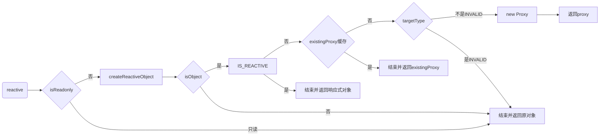

# reactive的实现原理

执行[reactive](https://cn.vuejs.org/api/reactivity-core.html#reactive)时，会返回一个对象的响应式代理。

`ES6`提供了[Proxy](https://developer.mozilla.org/zh-CN/docs/Web/JavaScript/Reference/Global_Objects/Proxy)对象用于创建一个对象的代理，从而实现基本操作的拦截和自定义。

## 源码函数调用

`reactive`

